# IBM Cloud watsonx AI Integration Guide

## Overview

This document provides a detailed explanation of how IBM Cloud watsonx AI is integrated into the Sanicle women's health platform. The platform features dual AI capabilities by leveraging both Google's Gemini AI and IBM's watsonx AI to provide comprehensive health support for users.

While the primary AI Health Assistant (Sani) accessible via the main navigation uses Google's Gemini AI, the employee dashboard features a convenient chat widget in the bottom-right corner powered by IBM watsonx AI, providing an additional channel for health-related conversations.

## Integration Architecture

The watsonx AI integration follows a client-server architecture with these main components:

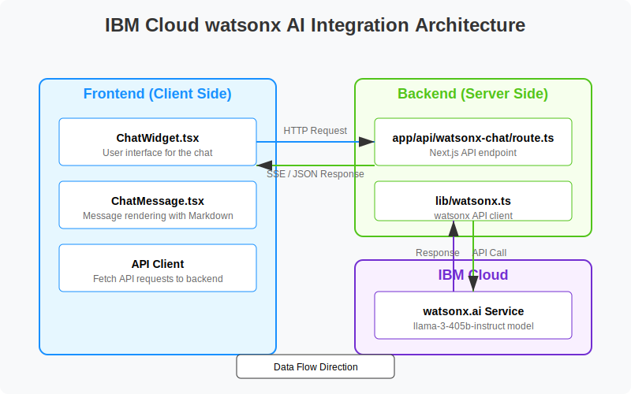

### Architecture Flow Diagram

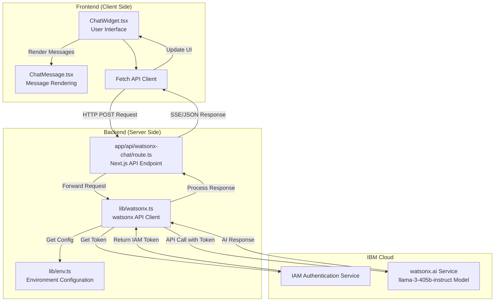

### Core Components

1. **Environment Configuration** (`lib/env.ts`)
   - Manages environment variables for watsonx API connectivity
   - Provides default values and configuration validation

2. **API Client** (`lib/watsonx.ts`)
   - Handles IBM Cloud authentication
   - Manages communication with watsonx AI API
   - Supports both standard and streaming response modes

3. **Backend API Route** (`app/api/watsonx-chat/route.ts`)
   - Next.js API endpoint that processes chat requests
   - Implements streaming with Server-Sent Events
   - Handles error conditions with graceful fallbacks

4. **Frontend Chat Widget** (`components/chat/ChatWidget.tsx`)
   - Floating chat button in the employee dashboard
   - Expandable chat interface with message history
   - Real-time response rendering with typing indicators

5. **Message Rendering Component** (`components/chat/ChatMessage.tsx`)
   - Renders AI responses with proper Markdown formatting
   - Handles various message types and styling

## Authentication Flow

The integration uses IBM Cloud IAM token-based authentication:

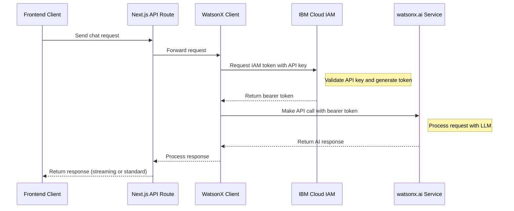

The token generation process:

```typescript
async function getIBMCloudToken(): Promise<string> {
  if (!WATSONX_CONFIG.API_KEY) {
    throw new Error('WatsonX API key is not configured');
  }
  
  const response = await fetch(WATSONX_CONFIG.TOKEN_URL, {
    method: 'POST',
    headers: {
      'Content-Type': 'application/x-www-form-urlencoded',
      'Accept': 'application/json'
    },
    body: `grant_type=urn:ibm:params:oauth:grant-type:apikey&apikey=${WATSONX_CONFIG.API_KEY}`
  });

  const data = await response.json();
  return data.access_token;
}
```

## Message Processing Flow

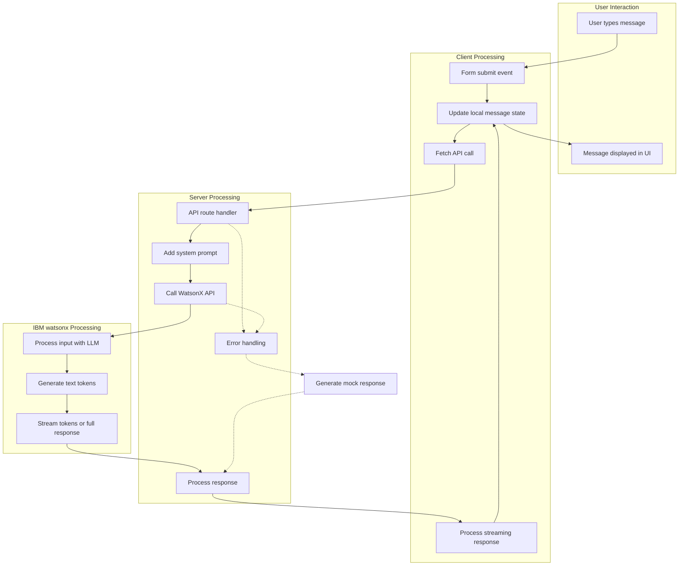

## Implementation Details

### 1. Environment Configuration

The integration requires several environment variables defined in the `.env.local` file:

```env
# IBM WatsonX AI configuration
NEXT_PUBLIC_WATSONX_API_URL=https://us-south.ml.cloud.ibm.com/ml/v4/deployments
WATSONX_API_KEY=your_watsonx_api_key
WATSONX_DEPLOYMENT_ID=your_watsonx_deployment_id
WATSONX_TOKEN_URL=https://iam.cloud.ibm.com/identity/token
WATSONX_VERSION=2021-05-01
```

These variables are loaded and validated in the `lib/env.ts` module:

```typescript
export const WATSONX_CONFIG = {
  API_KEY: process.env.WATSONX_API_KEY || '',
  DEPLOYMENT_ID: process.env.WATSONX_DEPLOYMENT_ID || '',
  API_URL: process.env.NEXT_PUBLIC_WATSONX_API_URL || 'https://us-south.ml.cloud.ibm.com/ml/v4/deployments',
  TOKEN_URL: process.env.WATSONX_TOKEN_URL || 'https://iam.cloud.ibm.com/identity/token',
  VERSION: process.env.WATSONX_VERSION || '2021-05-01'
};
```

### 2. System Prompt Configuration

The integration provides a system prompt that guides the watsonx AI to focus on women's health topics:

```typescript
export const DEFAULT_SYSTEM_MESSAGE: ChatMessage = {
  role: "system",
  content: `You are Sanicle's women's health assistant powered by WatsonX AI. Your role is to provide supportive conversations about women's physiological and psychological health. Focus on these key areas:

  1. Menstrual health: Provide evidence-based information about cycle tracking, symptoms, and wellness tips
  2. Reproductive health: Discuss general topics around fertility, pregnancy, and reproductive conditions
  3. Mental wellbeing: Offer supportive conversation about mood changes, stress management, and emotional health
  4. General wellness: Provide guidance on nutrition, exercise, and lifestyle choices that support women's health

  Guidelines for your responses:
  - Provide compassionate, judgment-free support
  - Base all health information on established medical knowledge
  - Clarify that you're not providing medical diagnosis or treatment
  - Encourage users to consult healthcare providers for personal medical concerns
  - Respect privacy and maintain a supportive tone
  - Format your responses using proper Markdown
  - Use proper headers with ## for main titles and ### for subtitles
  - Format lists correctly with proper spacing
  - Use **bold** for emphasis
  - Separate paragraphs with blank lines`
};
```

### 3. API Communication

The `lib/watsonx.ts` module handles communication with the watsonx AI service:

```typescript
export async function getWatsonxResponse(
  messages: ChatMessage[],
  streaming: boolean = false
): Promise<Response> {
  // Get IBM Cloud token
  const token = await getIBMCloudToken();
  
  // Determine endpoint URL based on streaming mode
  const endpointUrl = streaming
    ? `${WATSONX_CONFIG.API_URL}/${WATSONX_CONFIG.DEPLOYMENT_ID}/ai_service_stream?version=${WATSONX_CONFIG.VERSION}`
    : `${WATSONX_CONFIG.API_URL}/${WATSONX_CONFIG.DEPLOYMENT_ID}/ai_service?version=${WATSONX_CONFIG.VERSION}`;
  
  // Prepare the payload
  const payload = { messages };
  
  // Make request to WatsonX API
  return fetch(endpointUrl, {
    method: 'POST',
    headers: {
      'Content-Type': 'application/json',
      'Accept': streaming ? 'text/event-stream' : 'application/json',
      'Authorization': `Bearer ${token}`
    },
    body: JSON.stringify(payload)
  });
}
```

### 4. Backend API Route

The `/api/watsonx-chat` Next.js API route processes chat requests:

```typescript
export async function POST(req: NextRequest) {
  try {
    // Parse the request
    const body = await req.json();
    const { messages, streaming = false } = body;
    
    // Add system message to guide AI's responses
    const messagesWithSystem = [
      DEFAULT_SYSTEM_MESSAGE,
      ...messages
    ];
    
    // Call WatsonX API
    const response = await getWatsonxResponse(messagesWithSystem, streaming);
    
    // Return streaming response directly
    if (streaming) {
      return new NextResponse(response.body, {
        headers: {
          'Content-Type': 'text/event-stream',
          'Cache-Control': 'no-cache',
          'Connection': 'keep-alive',
        },
      });
    }
    
    // Handle standard response
    const responseData = await response.json();
    return NextResponse.json(responseData);
  } catch (error) {
    // Fall back to mock mode for any error
    return generateMockResponse(userInput, streaming);
  }
}
```

### 5. Frontend Chat Widget

The chat widget provides a user-friendly interface for interacting with the watsonx AI:

```tsx
export function ChatWidget() {
  const [isOpen, setIsOpen] = useState(false);
  const [input, setInput] = useState("");
  const [isLoading, setIsLoading] = useState(false);
  const [messages, setMessages] = useState<Message[]>([
    {
      role: "assistant",
      content: "Hi, I'm Sanicle's women's health assistant. I'm here to chat with you about physiological and psychological health topics. How can I support you today?",
    },
  ]);
  
  // Handle sending messages to the API
  async function handleSubmitStreaming(e: React.FormEvent) {
    e.preventDefault();
    
    if (input.trim() === "") return;
    
    const userMessage: Message = { role: "user", content: input };
    setMessages((prev) => [...prev, userMessage]);
    setInput("");
    setIsLoading(true);
    
    // Create an initial AI response message
    setMessages((prev) => [
      ...prev,
      { role: "assistant", content: "" },
    ]);
    
    try {
      const response = await fetch("/api/watsonx-chat", {
        method: "POST",
        headers: {
          "Content-Type": "application/json",
        },
        body: JSON.stringify({
          messages: [...messages, userMessage],
          streaming: true,
        }),
      });
      
      // Handle SSE response
      const reader = response.body?.getReader();
      if (!reader) throw new Error("Response body is null");
      
      let partialResponse = "";
      
      while (true) {
        const { done, value } = await reader.read();
        if (done) break;
        
        // Decode chunk
        const chunk = new TextDecoder().decode(value);
        
        // Parse SSE data
        const lines = chunk.split('\n');
        let parsedChunk = "";
        
        for (const line of lines) {
          if (line.startsWith('data: ')) {
            try {
              const jsonData = JSON.parse(line.substring(6));
              if (jsonData.generated_text) {
                parsedChunk += jsonData.generated_text;
              }
            } catch (e) {
              // Skip malformed JSON
            }
          }
        }
        
        if (parsedChunk) {
          partialResponse += parsedChunk;
          
          setMessages((prev) => {
            const newMessages = [...prev];
            newMessages[newMessages.length - 1] = {
              role: "assistant",
              content: partialResponse,
            };
            return newMessages;
          });
        }
      }
    } catch (error) {
      // Provide a fallback response when API is unavailable
      const fallbackResponses = [
        "I'm sorry, but I'm having trouble connecting to my backend services. Please try again later.",
        "The WatsonX AI service is currently unavailable. This may be due to missing or invalid API credentials.",
        "I encountered a network issue. The system administrator needs to check the WatsonX API configuration.",
      ];
      
      const randomFallback = fallbackResponses[Math.floor(Math.random() * fallbackResponses.length)];
      
      setMessages((prev) => {
        const newMessages = [...prev];
        newMessages[newMessages.length - 1] = {
          role: "assistant",
          content: randomFallback,
        };
        return newMessages;
      });
    } finally {
      setIsLoading(false);
    }
  }
  
  // Render the chat interface
  return (
    <Popover open={isOpen} onOpenChange={setIsOpen}>
      <PopoverTrigger asChild>
        <Button
          size="icon"
          className="fixed bottom-4 right-4 h-14 w-14 rounded-full shadow-lg"
        >
          {isOpen ? <X className="h-6 w-6" /> : <MessageSquare className="h-6 w-6" />}
        </Button>
      </PopoverTrigger>
      <PopoverContent
        align="end"
        className={cn(
          "mb-16 mr-4 flex h-[500px] w-[350px] flex-col p-0"
        )}
      >
        {/* Chat header */}
        <div className="flex items-center border-b px-4 py-3">
          <BotIcon className="mr-2 h-5 w-5" />
          <div>
            <h3 className="text-sm font-semibold">Health Assistant</h3>
            <p className="text-xs text-muted-foreground">WatsonX AI Health Assistant</p>
          </div>
        </div>
        
        {/* Message history */}
        <div className="flex-1 overflow-y-auto p-4">
          {messages.map((message, index) => (
            <ChatMessage key={index} message={message} />
          ))}
          {isLoading && messages[messages.length - 1]?.role !== "assistant" && (
            <div className="mt-3 flex items-center">
              <Avatar className="h-8 w-8 bg-primary/10">
                <AvatarFallback>
                  <BotIcon className="h-4 w-4" />
                </AvatarFallback>
              </Avatar>
              <TypingIndicator />
            </div>
          )}
          <div ref={messagesEndRef} />
        </div>
        
        {/* Message input */}
        <form onSubmit={handleSubmitStreaming} className="border-t p-4">
          <div className="flex gap-2">
            <Input
              placeholder="Type a message..."
              value={input}
              onChange={(e) => setInput(e.target.value)}
              className="flex-1"
              disabled={isLoading}
            />
            <Button
              size="icon"
              type="submit"
              disabled={isLoading || input.trim() === ""}
            >
              <Send className="h-4 w-4" />
            </Button>
          </div>
        </form>
      </PopoverContent>
    </Popover>
  );
}
```

## Server-Sent Events (SSE) Implementation

To provide a more natural, typing-like experience, the integration uses Server-Sent Events for streaming responses:

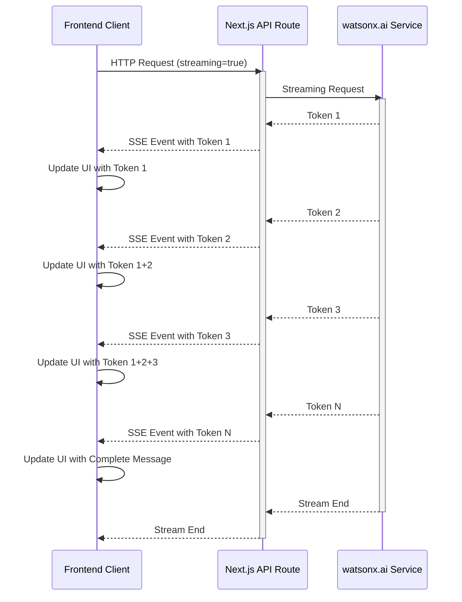

## Error Handling and Fallbacks

The integration implements robust error handling with fallbacks to ensure the user experience remains smooth even when the watsonx AI service is unavailable:

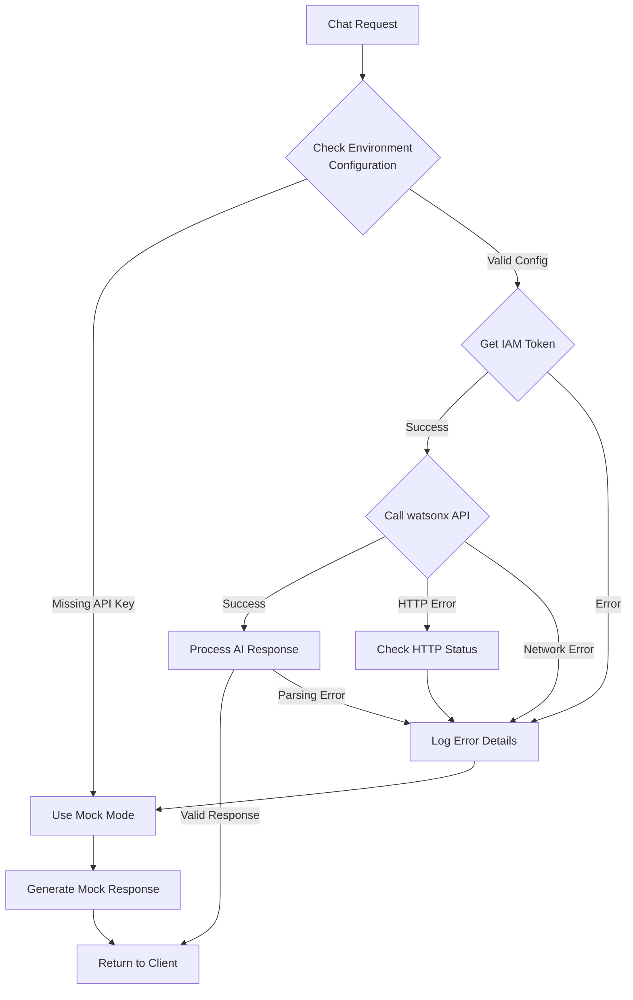

### Mock Response System

```typescript
function generateMockResponse(userInput: string, streaming: boolean = false): NextResponse {
  const mockResponseText = generateMockResponseText(userInput);
  
  if (streaming) {
    // Create a streaming mock response with simulated typing
    const encoder = new TextEncoder();
    const stream = new ReadableStream({
      start(controller) {
        const parts = mockResponseText.split(' ');
        let delay = 0;
        
        parts.forEach((part, index) => {
          delay += 30 + Math.random() * 70;
          setTimeout(() => {
            const packet = {
              generated_text: part + (index < parts.length - 1 ? ' ' : '')
            };
            const data = `data: ${JSON.stringify(packet)}\n\n`;
            controller.enqueue(encoder.encode(data));
            
            if (index === parts.length - 1) {
              controller.close();
            }
          }, delay);
        });
      }
    });
    
    return new NextResponse(stream, {
      headers: {
        'Content-Type': 'text/event-stream',
        'Cache-Control': 'no-cache',
        'Connection': 'keep-alive',
      },
    });
  } else {
    // For non-streaming, return a standard response
    return NextResponse.json({
      results: [{ generated_text: mockResponseText }]
    });
  }
}
```

## IBM Cloud Configuration Steps

```mermaid
flowchart LR
    subgraph "IBM Cloud Account Setup"
        CreateAccount["Create IBM Cloud Account"] --> Navigation["Navigate to watsonx.ai"]
        Navigation --> CreateProject["Create watsonx.ai Project"]
    end
    
    subgraph "Model Deployment"
        CreateProject --> DeployModel["Deploy LLM Model\n(llama-3-405b-instruct)"]
        DeployModel --> GetDeployment["Get Deployment ID"]
    end
    
    subgraph "API Access Configuration"
        GetDeployment --> GenerateKey["Generate API Key"]
        GenerateKey --> ConfigureEnv["Configure Environment Variables"]
    end
    
    subgraph "Application Setup"
        ConfigureEnv --> UpdateLocal["Update .env.local File"]
        UpdateLocal --> RestartApp["Restart Application"]
        RestartApp --> Test["Test Integration"]
    end
```

To set up the IBM watsonx AI integration in your deployment:

1. **Create IBM Cloud Account**:
   - Sign up at [IBM Cloud](https://cloud.ibm.com/)
   - Navigate to the watsonx.ai service

2. **Set Up watsonx.ai Project**:
   - Create a new project in watsonx.ai
   - Note the project ID for your environment variables

3. **Deploy a Language Model**:
   - Deploy the llama-3-405b-instruct model (or another suitable model)
   - Copy the deployment ID for your environment variables

4. **Generate API Key**:
   - Create an API key in your IBM Cloud dashboard
   - Ensure the key has appropriate permissions for watsonx.ai

5. **Configure Environment Variables**:
   - Add the following to your `.env.local` file:
     ```
     NEXT_PUBLIC_WATSONX_API_URL=https://us-south.ml.cloud.ibm.com/ml/v4/deployments
     WATSONX_API_KEY=your_watsonx_api_key
     WATSONX_DEPLOYMENT_ID=your_watsonx_deployment_id
     WATSONX_TOKEN_URL=https://iam.cloud.ibm.com/identity/token
     WATSONX_VERSION=2021-05-01
     ```

6. **Test the Integration**:
   - Navigate to the employee dashboard
   - Look for the chat icon in the bottom-right corner
   - Click the icon to open the chat widget
   - Test interaction with the watsonx AI assistant

## UI Components and User Experience

The watsonx AI chat integration provides a smooth, accessible user experience through these key UI components:

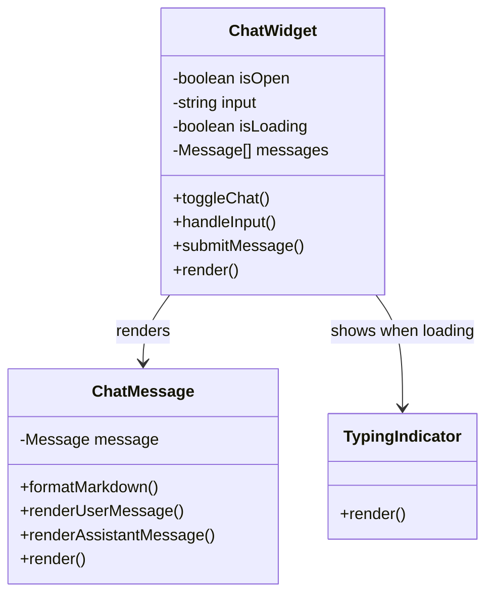

### User Experience Flow

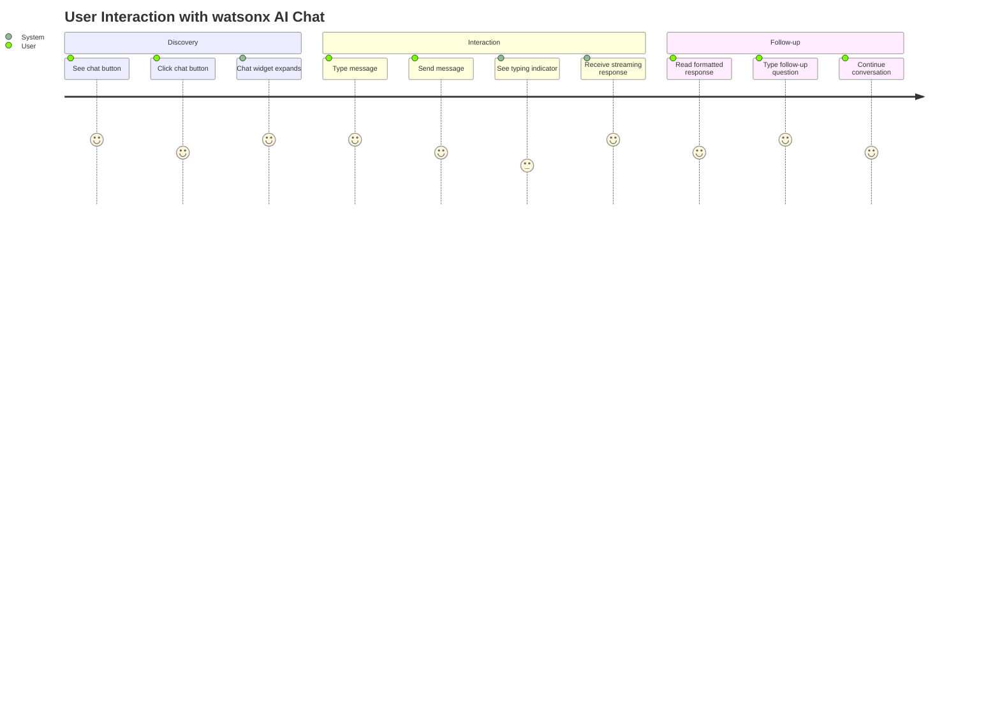

## Usage Guidelines

When using the watsonx AI chat widget:

1. **Conversation Context**: The system maintains conversation history within a session
2. **Response Formatting**: The AI formats responses using Markdown for better readability
3. **Healthcare Focus**: The AI is specifically trained to discuss women's health topics
4. **Error Recovery**: If you encounter errors, refreshing the page resets the chat widget

## Performance Considerations

- **Streaming vs. Standard Responses**: The implementation supports both streaming and standard response modes, with streaming providing a more interactive experience
- **Response Time**: Initial responses may take 1-3 seconds depending on network conditions
- **Token Usage**: Be mindful of message length as it affects API token consumption
- **Browser Support**: The streaming feature requires a modern browser with Fetch API and ReadableStream support

## Resource Usage and Optimization

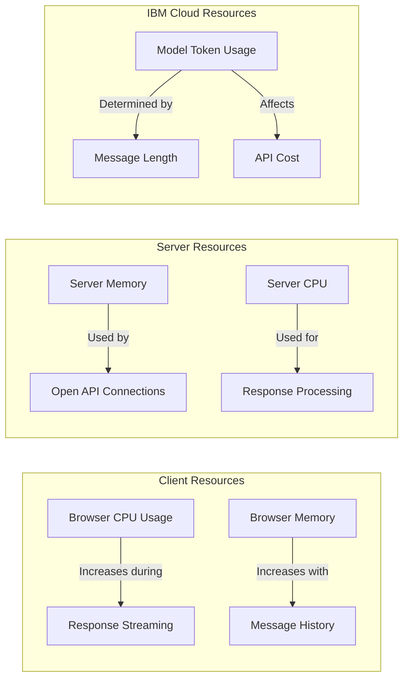

## Troubleshooting

Common issues and their solutions:

| Issue | Possible Cause | Solution |
|-------|---------------|----------|
| Chat widget doesn't appear | JavaScript disabled or error | Check browser console for errors |
| "Service unavailable" message | Missing environment variables | Verify API key and deployment ID configuration |
| Slow response times | Network latency or model processing | Consider using a different IBM Cloud region |
| Strange response formatting | Markdown rendering issues | Check ChatMessage component for rendering logic |
| Widget suddenly stops working | Token expiration or rate limiting | Implement token refresh mechanism |

### Troubleshooting Decision Tree

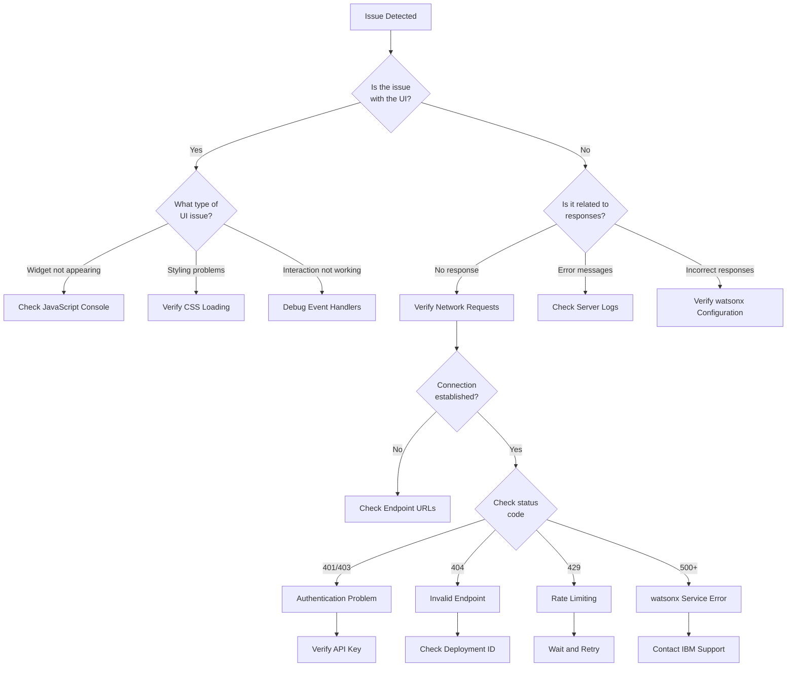

## Security Best Practices

The integration follows these security best practices:

1. **Server-Side API Key**: The watsonx API key is never exposed to the client
2. **IAM Token Authentication**: Uses temporary tokens instead of persistent credentials
3. **HTTPS Communication**: All API requests use encrypted connections
4. **Content Filtering**: The system prompt guides the AI away from inappropriate content
5. **Input Validation**: All user inputs are validated before processing

### Security Architecture

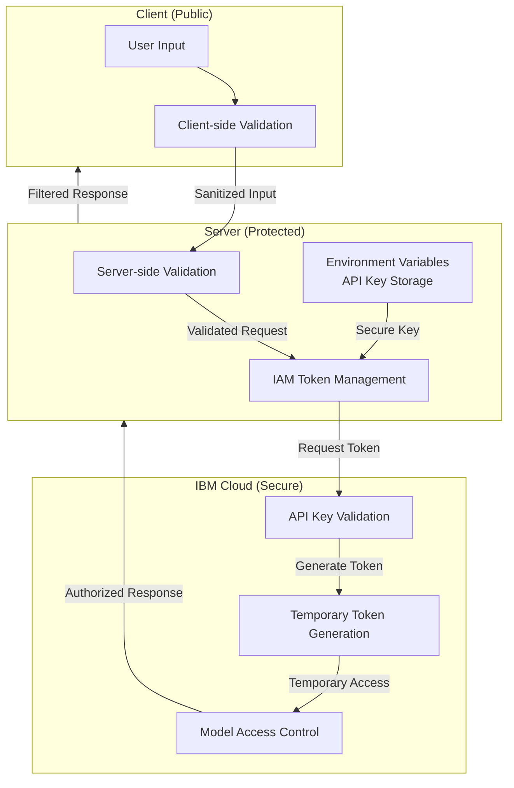

## Comparison with Google Gemini AI

The Sanicle platform integrates both IBM watsonx and Google Gemini AI, each with distinct roles:

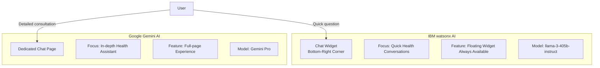

### Integration Benefits

| Feature | IBM watsonx AI | Google Gemini AI |
|---------|---------------|-----------------|
| Access Method | Floating widget in dashboard | Dedicated page via navigation |
| Interaction Style | Quick, contextual conversations | In-depth health consultations |
| UI Integration | Always available in context | Focused, distraction-free space |
| Best For | Brief questions during dashboard use | Dedicated health consultation sessions |
| Response Style | Concise, targeted answers | Comprehensive explanations |
| Availability | Immediate access from any dashboard screen | Requires navigation to dedicated section |

## Conclusion

The IBM Cloud watsonx AI integration provides Sanicle's platform with powerful conversational AI capabilities specifically tailored for women's health support. By leveraging the watsonx AI platform alongside Google's Gemini AI, the application offers users multiple channels for AI-assisted health guidance, making it more accessible and flexible for different user preferences.

The integration demonstrates a well-architected approach to incorporating enterprise-grade AI into a health-focused application, with careful attention to:

1. **Security and Privacy**: Server-side processing of sensitive credentials
2. **User Experience**: Responsive, streaming chat interface
3. **Error Resilience**: Graceful fallbacks and mock responses
4. **Performance Optimization**: Support for both streaming and standard modes
5. **Maintainability**: Clear separation of concerns across components 